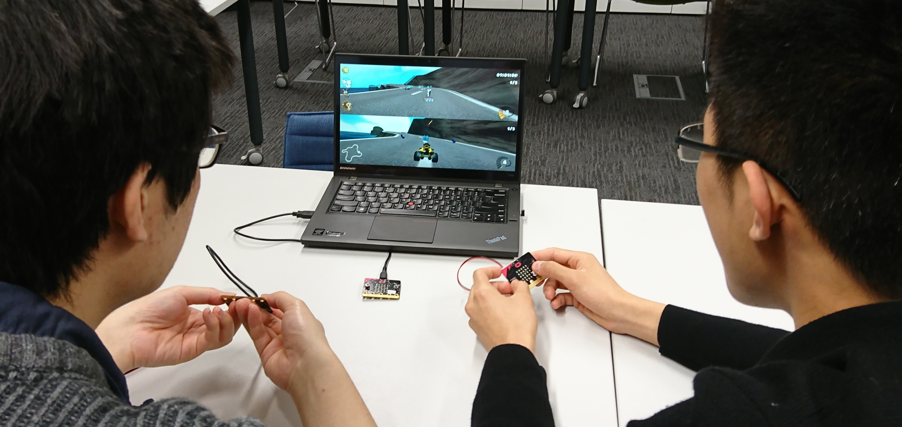

# Wireless Gaming with micro:bits

## Single/Multi-player wireless gaming for games with keyboard support (Linux)

This software is part of [Micro:bit as a Gaming Controller](https://github.com/JingqingZ/MicrobitController), a short HiPEDS group project.

Programmer: Philippos Papaphilippou

This project maps actions on wirelessly-connected micro:bits to keyboard events. In this way, a variety of multi-player games can be adapted without the need to modify their source code. As a test case we used [SuperTuxKart](https://supertuxkart.net/Main_Page). See the featured image, or the video below.

* Video: [Multi-player wireless gaming with micro:bits](https://www.youtube.com/watch?v=YR-1VejseQA)

#### Files 
* microbit-client.py Uploaded to the micro:bit of each player for wireless gaming
* microbit-server.py Uploaded to the micro:bit connected to the PC
* linux-keyboard.c Translates the serial output of the micro:bit server to keyboard events (Requires the libXtst-devel package or equivalent)
(see the source code comments for more information)
  
